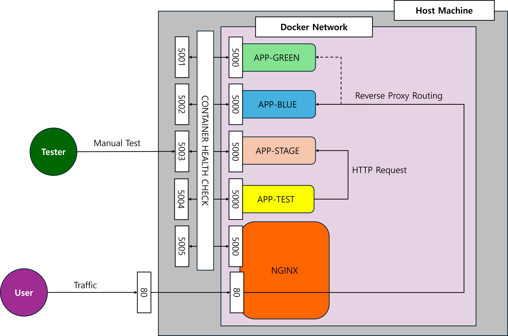

### 🚀 CI/CD Pipeline Practice: Blue/Green Deployment 

Welcome to the CI/CD Practice project! If you've ever wondered how modern software updates seamlessly without kicking users offline, you are in the right place.

# 📂 Project summary 

Here is the layout of the project you just cloned. Take a quick look to see where everything lives:
```Plaintext
cicd-example/
├── .github/workflows/
│   ├── ci-stage.yml          # [CI] Test and build verification on code push
│   └── deploy-main.yml       # [CD] Blue/Green zero-downtime deployment on main merge
├── app/
│   ├── Dockerfile            # Python application container specification
│   ├── main.py               # Web application (Flask)
│   └── templates/            # Frontend templates
├── nginx/                    # [Reverse Proxy] Load balancing and traffic switching
│   ├── myapp.conf            # Main configuration
│   └── templates/
│       ├── blue.conf         # Blue environment (currently active) config
│       └── green.conf        # Green environment (new deployment) config
├── scripts/                  # [Automation] Deployment and operation scripts
│   ├── check-health.ps1      # Health check script for new containers
│   └── nginx-setup.ps1       # Script for initial Nginx setup and traffic switching
├── tests/
│   └── ci_test.py            # Automated test scripts before deployment
├── .gitignore                # Git exclusion rules
└── README.md                 # Project documentation and guide
```

# 🏗️ Architecture Overview

Take a look at the diagram below. This is the local deployment environment we will be building on your machine: 



The User connects through Port 80, where our NGINX reverse proxy sits. 

NGINX acts as a traffic cop, routing live requests to either APP-BLUE (Port 5001) or APP-GREEN (Port 5002). 

Before code ever reaches the live environment, it goes through isolated containers: APP-TEST (Port 5004) for automated checks, and APP-STAGE (Port 5003) for manual testing. 

Everything runs inside an isolated Docker Network, actively monitored by container health checks.


# 📖 What is this project really about? 

In this project, we use it as a Remote Automation Engine to control our local infrastructure. 

If you are new to DevOps, this project will help you understand three core concepts: 


**Runner**: We use a Self-Hosted Runner, meaning GitHub sends deployment commands directly to your computer. 


**Workflow**: Our .yml files tell your machine exactly how to test code (ci-stage.yml) and how to swap live servers (deploy-main.yml). 


**Logic-Based Deployment**: The GitHub Action actively logs into your Nginx container, checks whether Blue or Green is currently running, and smartly deploys the update to the idle slot.


# 🎒 What you need to know before starting 

You absolutely don't need to be a DevOps engineer to get the hang of this project. If you have a basic grasp of the following concepts, you'll be completely fine: 
+1

### 1. Basic Git Operations 

Since GitHub Actions reacts to Git events, you'll need to know how to commit and push your code. 

We push code to a stage branch to test things out, and use the main branch for our actual deployments. 

### 2. The Bare Minimum of Docker 

We use Docker so we don't have to install a bunch of software directly on your server. You just need a high-level understanding of a few terms: 

**Image**: A read-only template of our application. 


**Container**: A running instance of that image. 


**Port Mapping**: Connecting a port inside the container (like 5000) to a port on your machine (like 80, 5001, or 5004) so you can view it in your browser. 

### 3. Simple Web & HTTP Concepts 

Our practice application is a simple Python web server using Flask. 

You should understand that clicking a button sends an HTTP request (like core or /legacy) to the server, and the server returns text or data. 

### 4. Reading Basic Python 

Our sample app (main.py) and automated tests (ci_test.py) are written in Python. 

You just need to be comfortable uncommenting a few lines to trigger our "failure scenarios". 

(Note: You do not need to learn PowerShell! The .ps1 scripts in this repo are just automated tools used by GitHub Actions behind the scenes.)


# 🚀 Getting Started & Setup 

Because this project uses your actual computer as the server, there are a few important setup steps. 

### 1. Lock Down Your Repository

Since we are using a Self-Hosted Runner, GitHub Actions will literally be executing code on your personal computer. 


Make it Private: When you fork or clone this repository, make sure your new repository is set to Private. 


Limit Pull Requests: Do not accept pull requests from strangers! 

### 2. Install the Prerequisites 


**Docker**: You need Docker installed and running (Docker Desktop is usually best for Windows). 


**PowerShell**: You need PowerShell installed and updated to read window-style path. 

### 3. Configure Your GitHub Secret 

Our deployment workflow needs to know where this project lives on your computer. 

Go to your GitHub repository: Settings > Secrets and variables > Actions. 

Create a new repository secret named PROJECT_ROOT. 

Set the value to the absolute path of the folder where you cloned this repository (e.g., C:\Users\YourName\Documents\cicd-example). 

### 4. Set Up the Self-Hosted Runner 

Go to Settings > Actions > Runners and click New self-hosted runner. 

Select your operating system (Windows) and follow the provided instructions to download and configure the runner. 

Run the run.cmd script to start the runner. Leave this terminal open!


# 🌿Preparing Your Git Branches 

Our CI robot only wakes up when you push to the stage branch, and our CD robot only triggers when code is merged into the main branch. 

Open your terminal in your project folder and run these commands to set up your workflow: 

```Bash
# 1. Link your local code to your new private GitHub repository
git remote add origin https://github.com/<YOUR_REPO>

# 2. Setup the Main branch (Deployment)
git branch -M main
git push -u origin main

# 3. Create and push the Stage branch (Testing)
git checkout -b stage
git push -u origin stage

# 4. Create and push the Dev branch (Where you will apply changes)
git checkout -b dev
git push -u origin dev
```

# 🛫 Step 6: The First Launch (Initial Setup) 

For our pipeline to automatically switch to a new version during a deployment, there needs to be an old version already running! We need to start up our initial deployment environment so the pipeline has something to work with. 

Open your PowerShell terminal and navigate to your project folder. 

Run the setup script:

```powershell
cd scripts
.\nginx-setup.ps1
```

**What is happening?** The script creates the myapp-net Docker network, builds your initial my-app:deploy image, launches an initial app container (like app-blue), and starts the NGINX proxy on Port 80.

**Verify it works**: 
Open your browser and navigate to http://localhost:80. You should see your simple Python application running!

# 🎬 Step 7: Running the Scenarios

### ❌ Scenario A: The "Obvious Bug" (Caught by CI)

**The Goal**: Introduce a broken feature and watch the Continuous Integration (CI) test catch it immediately.

**1. Code Changes**: 
First, make sure you are on your dev branch (git checkout dev). Open your code editor and make these exact changes:
* In app/main.py: Put the # symbols back in front of Scenario A to comment it out. 

* In app/main.py: Remove the # symbols from the lines under [Scenario B]. 

* Make sure Scenarios A and C are fully commented out.

**2. Git Commands: Push this code to the testing environment**:
```text
git add .
git commit -m "Testing Scenario B The Silent Bug"
git push origin dev

# Merge to stage to trigger the CI Action
git checkout stage
git merge dev
git push origin stage
```

**3. The Result**: Go to your GitHub Actions tab. The **CI - Integration Test (Stage)** workflow will start, run the test, and turn **RED**. The test expects a 200 OK response, but Scenario A explicitly returns a 500 error.
> [!NOTE]
> 💡 Notice that the failure on the GitHub Action runner does not stop or undo your git push. Your broken code was successfully pushed and is now sitting on the stage branch in GitHub. However, because the CI test failed, the pipeline immediately halted and blocked the code from being deployed to your Staging server!


### 🕵️ Scenario B: The "Silent Bug" (Caught in Staging) 


**The Goal**: Introduce a bug that passes automated tests but secretly breaks core function of the app.

**1. Code Changes**: 
Go back to your dev branch (git checkout dev). Leave the HTML and test files exactly as they are. 
+2

In app/main.py: Put the # symbols back in front of Scenario A to comment it out. 

In app/main.py: Remove the # symbols from the lines under [Scenario B]. 

Make sure Scenarios A and C are fully commented out. 

**2. Git Commands**: Push this code to the testing environment: 

```bash
# Save to your dev branch
git add .
git commit -m "Testing Scenario B The Silent Bug"
git push origin dev

# Merge to stage to trigger the CI Action
git checkout stage
git merge dev
git push origin stage
```

**3. The Result**: Watch the GitHub Actions tab. This time, the test turns GREEN! The CI Action finishes and deploys this code to your Staging server. 

Open your browser to http://localhost:5003. 

Click the "New Feature" button. It works!  Now click the "Core Function" button. It fails! 

Because Scenario B maliciously overwrote the core_response variable, you caught the bug manually in Staging. **Do not merge this to main!** 

### 🎉 Scenario C: The "Perfect Deployment" (Zero Downtime CD) 


**The Goal**: Deploy a perfectly working feature to your live users without any downtime. 

**1. Code Changes**: Return to your dev branch (git checkout dev). 

In app/main.py: Put the # symbols back in front of Scenario B. 

In app/main.py: Remove the # symbols from the lines under [Scenario C]. 

Make sure Scenarios A and B are fully commented out. 

**2. Git Commands** (Part 1 - Testing): 

```Bash
# Save to your dev branch
git add .
git commit -m "Testing Scenario C Working Feature"
git push origin dev

# Merge to stage to trigger the CI Action
git checkout stage
git merge dev
git push origin stage
```
Wait for the GitHub Action to turn green. You can check http://localhost:5003 again to verify everything works perfectly. 

**3. Git Commands** (Part 2 - Live Deployment):

Now, let's deploy this to the live server: 

```bash
# Merge your tested code into the main deployment branch
git checkout main
git merge stage
git push origin main
```

**4. The Result**: Watch the CD - Blue/Green Deployment (Main) workflow run. 

It builds the new code, starts the green container, checks its health, and flips the Nginx proxy. 

Keep your browser open to http://localhost:80. Without you doing anything, the page will automatically refresh and show your working "New Feature" button, proving you achieved a zero-downtime deployment!

